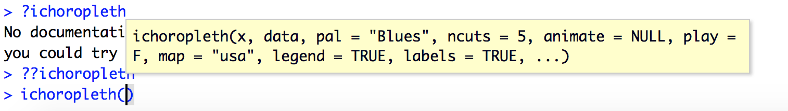
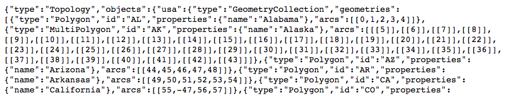

# About

This document shows two methods for creating time series maps of data for US States by year using the R statistical programming language. The two main R libraries we use to create these maps are:
1. rmaps (http://rmaps.github.io/)
2. ggplot2 (http://ggplot2.org)

## rmaps
The R package rmaps provides a simple set of commands for creating animated, interactive choropleth maps. 

> A choropleth map is one in which areas are symbolized (e.g. colored) by data values.

The underlying funcitionality is provided by Datamaps (http://datamaps.github.io/), a javascript library. The  output of rmaps is an html file that contains the code and data to view and interact with the maps.  You can read about the genesis of rmaps in [this blog post](http://rmaps.github.io/blog/posts/animated-choropleths/) by its creator, Ramnath Vaidyanathan.

## ggplot
The ggplot2 package is a widely used and extremely powerful R library for creating and customizing many different types of data plots including scatterplots, bar plots, and histograms, etc., as well as maps. We will use this library to create micromaps - a series of small maps for the same region, in this case US states, where the data vary along one facet, here time.

# Motivation
The main reason we chose to use R as opposed to another software tool are that the rmaps and ggplot packages allow us to create the desired output with relatively few steps. Our input data is in a spreadsheet, not a geographic data file format like the shapefile, and most of our statistical analysis is done in MS Excel. R provides one line code for reading in these files and rmaps provides one line for creating the interactive annual map series. As with most data projects the vast majority of the effort is in preparing the data in the format needed to produce the desired output. Our work is not exception. But the analyst can do that processing in the software of their choice, be it excel, R or another tool.

Another reason we chose R was that we wanted a workflow that could be done locally rather than with an online tool (e.g. [CARTO](http://carto.com), [Shiny](http://www.shinyapps.io/), [Tableau](http://www.tableau.com) to keep our work and data relatively private until we are ready to share it. Moreover, we wanted to use a free software tool rather than pay for software when were were unsure of the outcome.

# Data

To follow along with this tutorial we use the *U.S. State-Level Income Inequality Data* provided by Mark W. Frank on the website: http://www.shsu.edu/eco_mwf/inequality.html

The specific data file that we downloaded and preprocessed to create some sample data sets is: [http://www.shsu.edu/eco_mwf/Frank_WTID_2013.xls](http://www.shsu.edu/eco_mwf/Frank_WTID_2013.xls).

# Outcomes
Below are some examples of our output. **TO BE ADDED!**

# Getting started

### Step 1. Install required R libraries
```{r results='hide', message=FALSE, warning=FALSE}
# Install helper packages
required.pkg <- c('tidyr','plyr','dplyr','RColorBrewer','readxl','devtools','downloader')
pkgs.not.installed <- required.pkg[!sapply(required.pkg, function(p) require(p, character.only=T))]
if (length(pkgs.not.installed > 0)) {
  install.packages(pkgs.not.installed, dependencies=TRUE)
} else {
  print("Helper packages installed.")
}

# Install rMaps and rCharts packages for creating the map
if ("rMaps" %in% rownames(installed.packages()) == FALSE ) {
  require(devtools)
  install_github('ramnathv/rCharts@dev')
  install_github('ramnathv/rMaps')
} else {
  print("Rmaps installed.")
}

 
#--------------------
# Load Libraries
#--------------------
#library(reshape2)
#library(plyr)
library(tidyr)
library(plyr)
library(dplyr)
library(readxl)
library(RColorBrewer)
library(rCharts)
library(rMaps)
```

### Step 2. Read in data in the format required by *rmaps*
```{r, echo=TRUE}

# Identify the data to be mapped
#in_data_file <- "https://raw.githubusercontent.com/dlab-geo/rmapsByYear/master/data/Frank_WTID_2013_top1_long.csv"
in_data_file <- "data/Frank_WTID_2013_top1_long_2000to2013.csv"

# Read in the data
indata <- read.csv(in_data_file, stringsAsFactors = FALSE)

# Take a look at the data
head(indata)

# Range of data values
summary(indata$vals)

# Years 
sort(unique(indata$year))
```

### Step 3. Visualize the data using rmap ichoropleth function - default options


```{r, eval=FALSE}
#ichoropleth(Crime ~ State,
#  data = datm2[,1:3],
#  pal = 'PuRd',
#  ncuts = 5,
#  animate = 'Year' )
#
ichoropleth(vals ~ State, data = indata,  animate = 'year')
```


#### Vary the color palatte (or pal) using one of the options provided by the rColorBrewer package
```{r, eval=FALSE}
display.brewer.all()
```


You can see in the resultant image that there are three families of color palettes:
1. sequentional, eg YlOrRd, used to highlight numeric values as they increase/decrease
2. categorical, eg., set3, used to symbolize different categories of data
3. divergent, eg. Spectral, used to identify deviations around the mean values

For these data a sequential or divergent color palette would work best. Let's try YlOrRd (yellow-orange-red)

```{r, eval=FALSE}
ichoropleth(vals ~ State, data = indata,  animate = 'year', pal='YlOrRd')
```


You can add more bins for symbolizing the data. With R color brewer sequential palettes you can use up to 9, with divergent palettes 11. The recommended number is between 3-7 and the default for ichoropleth is 5. See ?brewer.pal for details.

```{r, eval=FALSE}
ichoropleth(vals ~ State, data = indata,  animate = 'year', pal='YlOrRd', ncuts=9)
```


### Other map options

Hide the map legend and / or the state abbreviation labels
```{r, eval=FALSE}
ichoropleth(vals ~ State, data = indata,  animate = 'year', pal='YlOrRd', legend=FALSE, labels=FALSE)
```


Customize the map style
```{r, eval=FALSE}

# Map only one year of data - in other words create a static map
ichoropleth(vals ~ State, data = subset(indata, year == 2005))

# Map a subset of years
ichoropleth(vals ~ State, data = subset(indata, year > 2005), animate="year")

# Add a Play button to advance through the year-levels automatically
ichoropleth(vals ~ State, data = subset(indata, year > 2005), animate="year", play=TRUE)
```


For more options to the ichoropleth function see: http://rmaps.github.io/blog/posts/animated-choropleths/ and the GitHub page for rmaps at: 
https://github.com/ramnathv/rMaps.


## Step 4. Add Custom Popups to the Map

By default, ichoropleth displays the full name of a state in a popup window when you move your mouse and hover over a state. You can customize the content of the popup to display the data value for a state for the given year. This is helpful if you do not want to display a legend or if you want to convey additional information.


```{r, eval=FALSE}
mymap <- ichoropleth(vals ~ State, data = indata, animate="year")
mymap$set(
  geographyConfig = list(
    popupTemplate = "#! function(geo, data){ return '<div class=\"hoverinfo\">' 
      + geo.properties.name + ' ' + data.year +  '<br>' +  + data.vals + '%' +  
    '</div>';  } !#"
  )
)
mymap
```


In the example above we save the ichoropleth map to the variable *mymap*. We then pass additional customizations to *Datamaps* that create a custom popup.  The *popupTemplate* is a function that passes in the name of the the state (geo.properties.name), the year for the data (data.year) and the data value for the state for that year (data.vals).  The values for data.year and data.vals come from the data frame that is used to create the map, in this case **indata**. In addition, we add to the popup a percent sign at the end of the data value using the code *' % '*.  The code *'\<br\>'* adds a line break between the state name and year and the data value.  You can pass any column that is in the input data frame (here indata) to the popupTemplate. For example, you can add a column called "popup_text" to your input data frame and populated it with a nicely formatted version of your data values you can then reference in the popupTemplate as *data.popup_text*.


## Step 5. Datamaps Customizations

You can pass options to the underlying Datamaps library to further customize your maps. Refer to the Datamaps [github.io site] (http://datamaps.github.io/) and [custom maps](https://github.com/markmarkoh/datamaps/blob/master/README.md#using-custom-maps) web page for details. Note that those pages show how to make Datamaps changes to javascript code. From within R you can set those values using the syntax shown in the code block above and summarized below. However, the mapping of customizations from Datamaps to ichoropleth can be complex.

1. save ichoropleth map: mymap <- ichoropleth(vals ~ State, data = indata, animate="year")
2. use the mymap.set(...) syntax to make the customizations shown in the Datamaps documentation.

### Changing the map data

By default ichoropleth uses the Datamaps USA states data which is stored in a `TopoJSON` file, which is a compressed variant of a [GeoJSON file](https://en.wikipedia.org/wiki/GeoJSON#TopoJSON).  This works with our input data because our data frame has a column containing state abbreviations called 'State'. This column must contain state abbreviations and is used to link the tabular data to the map data via the code:

> ichoropleth(`vals ~ State`, data = indata, animate="year")

Another reference to the Datamaps USA states data is in the `popupTemplate` reference to `geo.properties.name`. Here, `geo` is a reference to the [GeoJSON](https://en.wikipedia.org/wiki/GeoJSON) file that contains the geometry delineating US states and `properties.name` refers to the full state names.

The name of states data in the TopoJSON file is `usa`. If you look inside a GeoJSON file you can see this name in the first line of the file, right after the word "objects":



You can use a custom map with ichoropleth if: 1) the GeoJSON file is a url, 2) you can identify the name of the data in the GeoJson file.  For example take a look at this customized [GeoJSON file](https://raw.githubusercontent.com/dlab-geo/rmapsByYear/master/data/usa_with_bigger_DC_topo.json).  If the name is not `usa` it needs to be set using the `scope` Datamaps variable.

```{r, eval=FALSE}
mymap <- ichoropleth(vals ~ State, data = indata, animate="year")
mymap$set(
  dataUrl = "https://raw.githubusercontent.com/dlab-geo/rmapsByYear/master/data/usa_with_bigger_DC_topo.json",
  scope = 'usa', # you need to define the scope if the name of the map in the json file is not "usa"
  geographyConfig = list(
    popupTemplate = "#! function(geo, data){ return '<div class=\"hoverinfo\">' 
      + geo.properties.name + ' ' + data.year +  '<br>' +  + data.vals + '%' +  
    '</div>';  } !#"
  )
)
mymap

mymap$set(
  geographyConfig = list(
    dataUrl = "https://raw.githubusercontent.com/dlab-geo/rmapsByYear/master/data/usa_with_bigger_DC_topo.json",
    scope = 'usa', # you need to define the scope if the name of the map in the json file is not "usa"
    borderColor= map_border_color,
    popupTemplate = "#! function(geo, data){
    return '<div class=\"hoverinfo\"><strong>'+ geo.properties.name + ' ' + data.year + '</strong>' + '<br>' + data.data_label + data.popup_data + '</div>';  } !#"
  )
)
 
```
Below we show

```{r, eval=FALSE}
```


