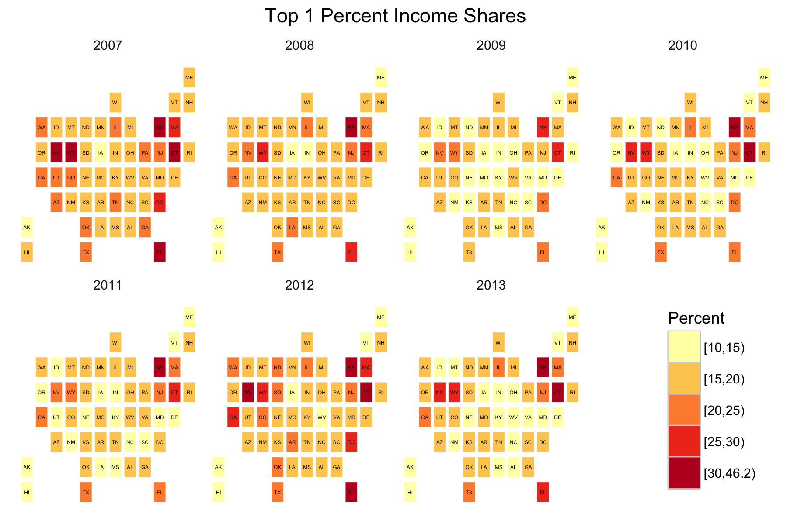
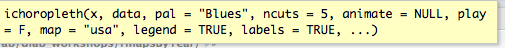
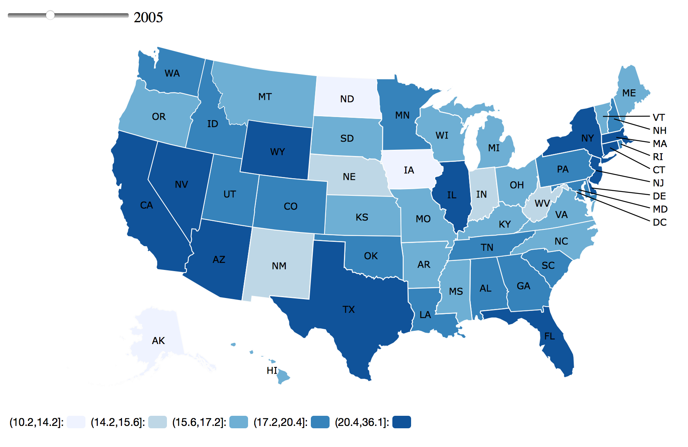
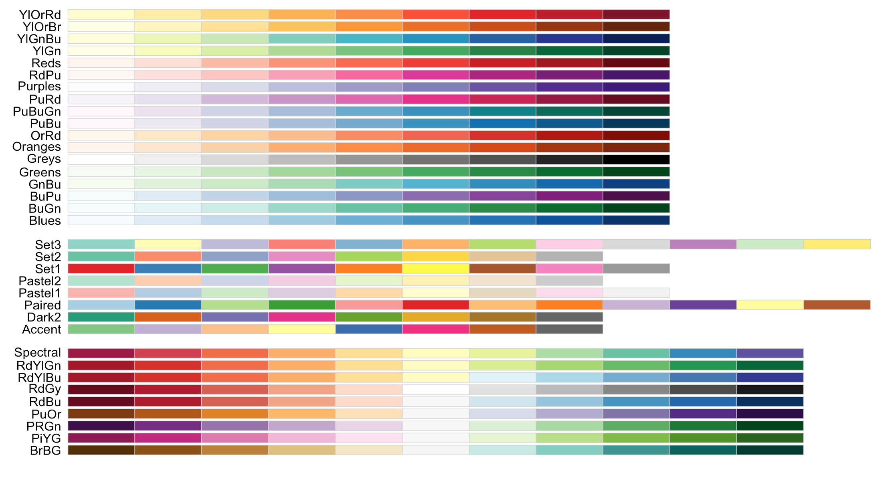
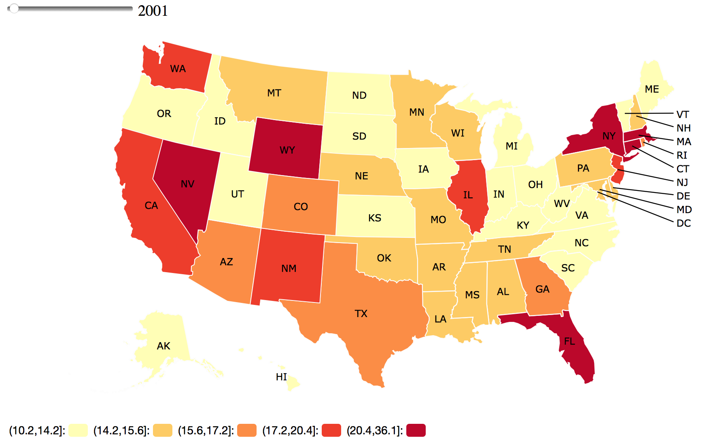
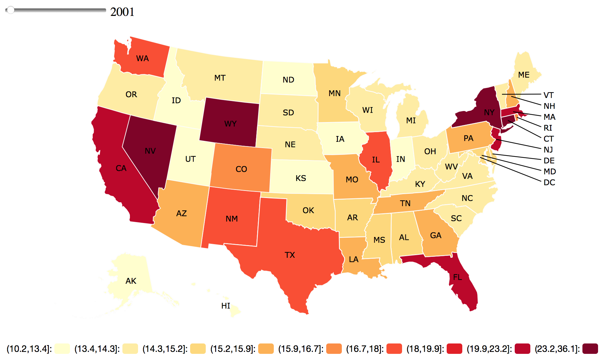
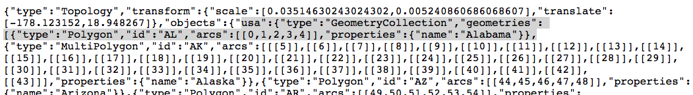
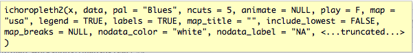

# About

This tutorial shows two methods for creating time series maps of state-level data by year using the R statistical programming language. The two main R libraries we use to create these maps are **rMaps** (http://rmaps.github.io/) and **ggplot2** (http://ggplot2.org)

## rMaps
The R package `rMaps` provides a simple set of commands for creating animated, interactive choropleth maps. A choropleth map is one in which regions, such as states, are symbolized (e.g. colored) by data values for those regions. The output of rMaps can be saved to an HTML file that you can open in a web brower. This allows you to view a year's worth of data and advance through all years using a slider or button control on the map. Interactivity is added in the form of popup windows that can display. An example of an rMaps choropleth map is shown below.

<p>
<iframe src="html/map1.html" seamless width="750px" height="500px" scrolling="no"></iframe>
<p>
For details on how to install rMaps and create choropleth maps see the [rMaps github site](https://github.com/ramnathv/rMaps). You can also read about the genesis of rMaps in [this blog post](http://rmaps.github.io/blog/posts/animated-choropleths/) by its creator, Ramnath Vaidyanathan. The underlying funcitionality for creating these maps is provided by Datamaps (http://datamaps.github.io/), a javascript library. 

This tutorial provides additional rMaps examples and tips as well as custom code for extending the functionality of rMaps.

## ggplot2
The `ggplot2` package is a widely used and extremely powerful R library for creating and customizing many different types of data plots including scatterplots, bar plots, and histograms, etc., as well as maps. We will use this library to create micromaps - a series of small maps for the same region, in this case US states, where the data vary along one facet, here time. We include code for this at the end of the tutorial to provide an alternate method for geographically visualizing many years of data. An example is shown below.




# Motivation
The main reason we chose to use R as opposed to another software tool are that the rMaps and ggplot packages allow us to create the desired output with relatively few steps. Our input data is in a spreadsheet, not a geographic data file format like the shapefile, and most of our statistical analysis is done in MS Excel. R provides one line code for reading in these files and rMaps provides one line for creating the interactive annual map series. As with most data projects the vast majority of the effort is in preparing the data in the format needed to produce the desired output. Our work is not exception. But the analyst can do that processing in the software of their choice, be it excel, R or another tool.

Another benefit of using R was that we wanted a workflow that could be done locally rather than with an online tool (e.g. [CARTO](http://carto.com), [Shiny](http://www.shinyapps.io/), [Tableau](http://www.tableau.com) to keep our work and data relatively private until we are ready to share it. Moreover, we wanted to use a free software tool rather than pay for software when were were unsure of the outcome.


# Data

To follow along with this tutorial we use the *U.S. State-Level Income Inequality Data* provided by Mark W. Frank on the website: (http://www.shsu.edu/eco_mwf/inequality.html). The specific data file that we downloaded and preprocessed to create some sample data sets is: [http://www.shsu.edu/eco_mwf/Frank_WTID_2013.xls](http://www.shsu.edu/eco_mwf/Frank_WTID_2013.xls). We have copied and created subsets of these data to facilitate this tutorial.


## Tutorial Data

You can get all the files for this tutorial if you do the following.

1. Go to (https://github.com/dlab-geo/rmapsByYear), click on the Clone or Download button and then select Download Zip.  
2. Unzip the files
3. Make a note of the folder in which the files reside in your computer so that you can open them.
4. Open the `rmapsByYear.Rmd` RMarkdown file in RStudio. We will walk through & execute the code in this file in RStudio.
4. Open the `rmapsByYear.HTML` file in your web browser to follow along with the presentation and as a reference to move ahead or catch up.

 
# Creating RMaps

## Setup

### Install required R libraries
```{r results='hide', message=FALSE, warning=FALSE}
#
# Install helper packages
#
# first identify the required packages
required.pkg <- c('tidyr','plyr','dplyr','RColorBrewer','readxl','devtools','downloader','rmarkdown','knitr')

#check to see which ones are not installed
pkgs.not.installed <- required.pkg[!sapply(required.pkg, function(p) require(p, character.only=T))]

#install the ones not installed
if (length(pkgs.not.installed > 0)) {
  install.packages(pkgs.not.installed, dependencies=TRUE)
} else {
  print("Helper packages installed.")
}

# Install rMaps and rCharts packages for creating the rMaps
if ("rMaps" %in% rownames(installed.packages()) == FALSE ) {
  require(devtools)
  require(downloader)
  install_github('ramnathv/rCharts@dev')
  install_github('ramnathv/rMaps')
} else {
  print("Rmaps installed.")
}
```


### Load the required R libraries
```{r results='hide', message=FALSE, warning=FALSE}
#--------------------
# Load Libraries
#--------------------
library(tidyr)
library(plyr)
library(dplyr)
library(readxl)
library(RColorBrewer)
library(rCharts)
library(rMaps)
```


### Explore the Data

You must set the working directory to a location on your computer in which you downloaded the tutorial files.
```{r, echo=TRUE}
# Where am I?
getwd()

# set working directory
my_rmaps_directory <- "/Users/patty/Documents/Dlab/dlab_workshops/rmapsByYear"
setwd(my_rmaps_directory)

# Identify the data to be mapped
in_data_file <- "https://raw.githubusercontent.com/dlab-geo/rmapsByYear/master/data/Frank_WTID_2013_top1_long_2000to2013.csv"

# Read in the data as is - not guessing about data types like factors
indata <- read.csv(in_data_file, stringsAsFactors = FALSE)

# Take a look at the data
dim(indata)
head(indata)
str(indata)

# Range of data values
summary(indata$vals)

# Years 
sort(unique(indata$year))
```


## Create a Basic rMap

You can geographically visualize the data with the rMaps `ichoropleth` function. A simple call to this function using the basic paramaters is shown below. You can read this as "Create a choropleth map of the data in the `indata` data frame using the data in the `vals` column to symbolize the regions identified in the `State` column. For this basic functionality, rMaps requires map regions to be US states identified by their two letter abbreviations. These identifiers are used to access map data in the Datamaps package. The animate parameter identifies the column in the data frame that contains the year for each data observation.



### Our first ichoropleth rMap
```{r, eval=FALSE}
ichoropleth(vals ~ State, data = indata,  animate = 'year')
```




### Save to an HTML file
You can save the ichoropleth map to an HTML file. This way you can share the map by emailing it or posting it on a website or simply by displaying it locally in the web browser on your computer.

```{r, eval=FALSE}
map1 <- ichoropleth(vals ~ State, data = indata,  animate = 'year')

# display the map
map1

# save the map
map1$save('map1.html', cdn=TRUE)
```

Above, setting the value `cdn=TRUE` embeds references to required javascript libraries as URLs inside the output HTML file rather than needing to include the code for those libraries in our HTML file. Bottom line - this keeps the file size smaller.

If you navigate to your working directory you can double-click on your HTML file (above named `map1.html`) to view your ichoropleth map.  

<p>&nbsp; &nbsp;</p> <!-- Insert some blank space to improve readability -->

###  **CHALLENGE 1**

1. Create an ichoropleth map and save it to HTML. Then open it in your web browser.
2. Take a look at the map of 2002 data. One state is not like the other. Which state is it? Can you look at the map and the data frame to figure out why?  


<p>&nbsp; &nbsp;</p> <!-- Insert some blank space to improve readability -->


## Customizing an rMap

### Setting Map Colors

You can vary the color palatte (or pal) by using one of the named options provided by the `rColorBrewer` package.
```{r, eval=FALSE}
display.brewer.all()
```


  
In the image above there are three families of color palettes:

1. `sequentional`, eg YlOrRd, which can be used to highlight numeric values as they increase or decrease
2. `categorical`, eg., Set3, used to symbolize different categories of data
3. `divergent`, eg. Spectral, used to identify deviations around the mean values

For these data a sequential or divergent color palette would work best. Let's try YlOrRd (yellow-orange-red).

```{r, eval=FALSE}
ichoropleth(vals ~ State, data = indata,  animate = 'year', pal='YlOrRd')
```


By default, the ichoropleth function uses the `quantile` function to create 5 bins (or quintiles) into which the mapped data values are classified. The syntax for that command is shown below. A unique color is assigned to each bin. You can see the range of values included in each bin and the color assigned to it in the legend. Note, in the legend an open parantheses indicates that the data value is not included in the bin while a bracket indicates it is.

```{r}
quantile(indata$vals, seq(0, 1, 1/5))
     
```


You can add more bins for symbolizing the data. With R color brewer sequential palettes you can use up to 9, with divergent palettes 11. The recommended number is between 3-7 and the default for ichoropleth is 5. See ?brewer.pal for details.

```{r, eval=FALSE}
ichoropleth(vals ~ State, data = indata,  animate = 'year', pal='YlOrRd', ncuts=9)
```



### Other map options

Hide the map legend and / or the state abbreviation labels
```{r, eval=FALSE}
ichoropleth(vals ~ State, data = indata,  animate = 'year', pal='YlOrRd', legend=FALSE, labels=FALSE)
```


Customize the map style
```{r, eval=FALSE}

# Map only one year of data - in other words create a static map
ichoropleth(vals ~ State, data = subset(indata, year == 2005))

# Map a subset of years
ichoropleth(vals ~ State, data = subset(indata, year < 2008), animate="year")

# Add a Play button to advance through the year-levels automatically
ichoropleth(vals ~ State, data = subset(indata, year < 2008), animate="year", play=TRUE)
```


For more options to the ichoropleth function see: http://rmaps.github.io/blog/posts/animated-choropleths/ and the GitHub page for rmaps at: 
https://github.com/ramnathv/rMaps.

<p>&nbsp; &nbsp;</p> <!-- Insert some blank space to improve readability -->


###  **CHALLENGE 2**

1. Create an ichoropleth map of the data using a divergent color palette and 7 data bins.
2. Make a map without the State abbreviations displayed on the map.
3. Create a map of a subset of the years of data, from 2005 - 20009.


<p>&nbsp; &nbsp;</p> <!-- Insert some blank space to improve readability -->


## Adding Popups to the Map

By default, ichoropleth displays the full name of a state in a popup window when you move your mouse and hover over a state. You can customize the content of the popup to display the data value for a state for the given year. This is helpful if you do not want to display a legend or if you want to convey additional information.


```{r, eval=FALSE}
# create the map
map2 <- ichoropleth(vals ~ State, data = indata, animate="year")

# customize the map by adding a popup
map2$set(
  geographyConfig = list(
    popupTemplate = "#! function(geo, data){ return '<div class=\"hoverinfo\">' 
      + geo.properties.name + ' ' + data.year +  '<br>' +  data.vals + '%' +  
    '</div>';  } !#"
  )
)

# display the map
map2 

# save the map
map2$save('map2.html', cdn=TRUE)
```


In the example above we save the ichoropleth map to the variable `map2`. We then pass additional customizations to *Datamaps* that create a custom popup.  The `popupTemplate` is a function that identifies the name of each state (geo.properties.name), the year for the data (data.year) and the data value for the state for that year (data.vals).  The values for data.year and data.vals come from the data frame that is used to create the map, in this case `indata`. In addition, we add to the popup a percent sign at the end of the data value using the code `+ '%' + `.  The code `'\<br\>'` adds a line break between the state name and year and the data value.  You can pass any column that is in the input data frame (here indata) to the popupTemplate. For example, you can add a column called `popup_text` to your input data frame and populated it with a nicely formatted version of your data values you can then reference in the popupTemplate as `data.popup_text`.  To really get fancy with popup customizations you need to know a little HTML syntax.  

> **Important**: When you add popup data you significantly increase the size of the output map. The popup contents may not display properly in the RStudio viewer (may not update). So, save your maps as HTML files and check the output map in a web browser rather than in RStudio.

<p>&nbsp; &nbsp;</p> <!-- Insert some blank space to improve readability -->

### **CHALLENGE 3**

1. Make a change to the popup text used for map2. Instead of displaying `+ data.vals + "%"` try putting the string "Percent:" in front of the data.vals and removing the trailing percent sign.

<p>&nbsp; &nbsp;</p> <!-- Insert some blank space to improve readability -->


## Advanced Customizations

You can pass options to the underlying Datamaps library to further customize your maps. Refer to the [Datamaps website](http://datamaps.github.io/) and [custom maps](https://github.com/markmarkoh/datamaps/) web page for details. Those pages show how to make Datamaps changes to javascript code. However, implementing Datamaps customizations in rMaps can be complex. The basic method for implementing Datamaps changes is with the `map.set()` function. We used that above to create popups for map2.

For example, the map below changes the `borderWidth` for each state to **3** and the `borderColor` to **black**.

```{r, eval=FALSE}

# create the map
map3 <- ichoropleth(vals ~ State, data = indata, animate="year")

# customize the map
map3$set(
  geographyConfig = list(
    borderWidth=3,
    borderColor='black',
    popupTemplate = "#! function(geo, data){ return '<div class=\"hoverinfo\">' 
      + geo.properties.name + ' ' + data.year +  '<br>' +  data.vals + '%' +  
    '</div>';  } !#"
  )
)

# display the map
map3 

# save the map
map3$save('map3.html', cdn=TRUE)
```

> **Important** Commas are important in the map$set() function. You must have a comma after each element in a list but you cannot have a trailing comma at the end.

<p>&nbsp; &nbsp;</p> <!-- Insert some blank space to improve readability -->

###  **CHALLENGE 4**

1. Go to the Datamaps [custom maps](https://github.com/markmarkoh/datamaps/) web page, and scroll down to the section *Configuration options and default settings*. 
Alter the code for map3 above to set the highlight border color when you mouse over a state to yellow.

<p>&nbsp; &nbsp;</p> <!-- Insert some blank space to improve readability -->


### Using Different Map Data

One customization that you may want to make is to change the map data. We decided to do this when we realized that Washington DC is so small on the default map that you cannot hover over it and see its popup. Consequently, we downloaded the states data and made the region for DC a bit bigger so we could see the popup and thus the data value. 

By default ichoropleth uses the Datamaps USA states data which is stored in a `TopoJSON` file, which is a compressed variant of a [GeoJSON file](https://en.wikipedia.org/wiki/GeoJSON#TopoJSON).  Each US State in the TopoJSON file has an `ID` with the state abbreviaton, a `name` property with the full state name, and geometry `arcs` that identifies the boundary of each state. Together these data have the `layer name` *usa*. You can see this information by looking at the [Datamaps USA TopoJSON file](https://raw.githubusercontent.com/markmarkoh/datamaps/master/src/js/data/usa.topo.json).



You can use a custom map with ichoropleth if the following conditions are true.

1. The geographic data are in a TopoJSON (not GeoJSON) file and you can access that file via a URL, 
2. You can identify the `layer name` of the data in the TopoJson file.  You can see above the layer name `usa` right after the keyword `objects`. If the name is not `usa` it needs to be set using the `scope`variable.
3. The id of each polygon in the TopoJSON file is has a corresponding value in the R data frame. Thus far our rMaps have used state abbrevation in the States column.

Because we copied the Datamaps USA TopoJSON file and edited it, (2) and (3) above are the same. We can just add a `dataUrl` parameter to access our customized TopoJSON file.

```{r, eval=FALSE}

# create the map
map4 <- ichoropleth(vals ~ State, data = indata, animate="year")

# customize the map
map4$set(
  geographyConfig = list(
    dataUrl = "https://raw.githubusercontent.com/dlab-geo/rmapsByYear/master/data/usa_with_bigger_DC_topo.json",
    popupTemplate = "#! function(geo, data){ return '<div class=\"hoverinfo\">' + geo.properties.name + ' ' + data.year +  '<br>' +  + data.vals + '%' +  '</div>';  } !#"
  ) 
)

# display the map
map4

# save the map
map4$save('map4.html', cdn=TRUE)
```

If you compare `map2.html` with `map4.html` in a web browser (not in RStudio!) you will see that map4.html allows you to view the popup for Washington D.C!


### Mapping States as Squares

With a completely different TopoJSON file you need to make a few more customizations. This [R-bloggers post](https://www.r-bloggers.com/rmaps-mexico-map/) walks you through the details. Inspired by this [Obesity map series](http://flowingdata.com/2016/09/26/the-spread-of-obesity/) we wanted to try visualizing the data with States represented as squares instead of the actual state boundaries. This technique minimizes the differences due to land area yet retains locational familiarity. 

We downloaded this state squares [GeoJSON file](https://raw.githubusercontent.com/geobabbler/us-state-squares/master/state_squares.geojson) from Bill Dollin's GitHub site (referenced in [blog post by Kyle Walker](http://rpubs.com/walkerke/obesity_squares)) and converted it to a TopoJSON file. By looking at the data in this file we could see that the layer name is `state_squares`. 
Kyle Walker's blog post recommends displaying the state squares using an `equirectangular` map projection. Setting the projection parameters in rMaps/Datamaps is very complex even when you know about map projections & coordinate reference systems, topics beyond the scope of this tutorial. Folks without this knowledge can still use rMaps and Datamaps to create great maps. But to go beyond the defaults and work with custom maps requires learning about geographic data along with some experimentation (i.e. cut, paste & edit until it works). Fortunately the [map example](http://geobabbler.github.io/assets/demos/us-states-squares/example/) in Bill Dollin's github site provides the needed projection parameters for the state squares data.


Below we show how to use the states squares data in a custom rMap. In this case we specifiy the name of the map layer by setting `scope=state_squares`. The `setProjection` parameter refers to the parameters of the map projection used to locate the map data in geographic space. Additionally, in the popup we change the variable used to map the state name to `geo.id`.

```{r, eval=FALSE}

# create the map
map5 <- ichoropleth(vals ~ State, data = indata, animate="year")

# customize the map
map5$set(
   geographyConfig = list(
    dataUrl = "https://raw.githubusercontent.com/dlab-geo/rmapsByYear/master/data/state_squares_topo.json",
    popupTemplate = "#! function(geo, data){ return '<div class=\"hoverinfo\">' + geo.id + ' ' + data.year +  '<br>' +  + data.vals + '%' +  '</div>';  } !#"
  ) ,
  scope="state_squares",
  setProjection = '#! function( element, options ) {
    var projection, path;
    projection = d3.geo.equirectangular()
      .scale(2000)
      .center([-96,41])
      .translate([element.offsetWidth / 2, element.offsetHeight / 2]);
    path = d3.geo.path().projection( projection );
    return {path: path, projection: projection};
  } !#'
)

# display the map
map5

# save the map
map5$save('map5.html', cdn=TRUE)
```


That works pretty well, but the equirectangular map projection stretches the country too much in an east-west direction. Let's try the `mercator` projection which will give a North-South stretch to the mapped squares. Consquently, the default height of the map, which is 500 pixels, cuts off some of the data. We can address that by setting the map hieght to `600` pixels. Feel free to experiment with different height values.

```{r, eval=FALSE}
map6 <- ichoropleth(vals ~ State, data = indata, animate="year")
map6$set(
  geographyConfig = list(
    dataUrl = "https://raw.githubusercontent.com/dlab-geo/rmapsByYear/master/data/state_squares_topo.json",
    popupTemplate = "#! function(geo, data){ return '<div class=\"hoverinfo\">' + geo.id + ' ' + data.year +  '<br>' +  + data.vals + '%' +  '</div>';  } !#"
  ) ,
  scope="state_squares",
  height=600,
  setProjection = '#! function( element, options ) {
    var projection, path;
    projection = d3.geo.mercator()
      .scale(2000)
      .center([-96,41])
      .translate([element.offsetWidth / 2, element.offsetHeight / 2]);
    path = d3.geo.path().projection( projection );
    return {path: path, projection: projection};
  } !#'
)
map6
map6$save('map6.html', cdn=TRUE)
```


# Extending rMaps

The ichropleth function is a great convenience wrapper around Datamaps. It doesn't try to do too much. It does one thing very well - creating an annual map series for state-level data. To do more, you can write code to create maps directly with the `rCharts` and `Datamaps` packages. Code examples for getting started with this are shown in [this blog post](http://rmaps.github.io/blog/posts/animated-choropleths/).

Another option is to extend the code for ichoropleth to make it a bit more customizable. We did this by creating the function `ichoropleth2` which is in the R script file `ichoropleth2.R`. 

### To access the ichoropleth2 function first `source` the ichoropleth2.R script.
```{r}

source('R/ichoropleth2.R')

```

Options you can set in ichoropleth2 include:

- `map_title`='My map title'  # set the map title
- `include_lowest`=FALSE # should the lowest data value be included in the first data bin
- `map_breaks`=c(0,10,30,100) # set manual map breaks

We have also added some forward and back buttons around the year slider so that it is easier to step between years.




Let's try it.

```{r, eval=FALSE}
map7 <- ichoropleth2(vals ~ State, data = indata, animate="year", map_title='Hello Map, ')
map7$set(
  geographyConfig = list(
    popupTemplate = "#! function(geo, data){ return '<div class=\"hoverinfo\">' 
      + geo.properties.name + ' ' + data.year +  '<br>' +  + data.vals + '%' +  
    '</div>';  } !#"
  )
)

# display the map
map7 

# save the map
map7$save('map7.html', cdn=TRUE)
```

<p>&nbsp; &nbsp;</p> <!-- Insert some blank space to improve readability -->

###  **CHALLENGE 5**

1. Create an ichoropleth2 map with a title that better describes the data being mapped.
2. Create an ichoropleth2 map that includes the lowest data value in the first bin.
3. Create an ichoropleth2 map that uses custom breaks for the data bins.
<p>&nbsp; &nbsp;</p> <!-- Insert some blank space to improve readability -->


### Mapping No Data Values

The `ichoropleth` function requires very tidy input data. The data we have worked with so far has no NA or no data values. Let's set some values to NA and then map them.

```{r, eval=FALSE}

# Add some no data values
indata[indata$State=='CA' & indata$year==2002,]$vals <-NA
indata[indata$State=='CA' & indata$year==2004,]$vals <-NA

# Update the popup text for those data
indata[indata$State=='CA' & indata$year==2002,]$vals <-NA
indata[indata$State=='CA' & indata$year==2004,]$vals <-NA

summary(indata$vals)

# Mapping data with no data values won't work with the ichoropleth function
ichoropleth(vals ~ State, data = indata, animate="year")

#... unless you omit those rows of data
map8 <- ichoropleth(vals ~ State, data = na.omit(indata), animate="year")
map8

# We will add the popup so we can see the data values for each state-year combo
map8$set(
  geographyConfig = list(
    popupTemplate = "#! function(geo, data){ return '<div class=\"hoverinfo\">' 
      + geo.properties.name + ' ' + data.year +  '<br>' +  + data.vals + '%' +  
    '</div>';  } !#"
  )
)

# display the map
map8 

# save to HTML - need to look at the HTML file to explore how ichoropleth handles missing years of data
map8$save('map8.html', cdn=TRUE)
```

### **CHALLENGE 6**

1. What does the map8.html display for the no data values (California, 2002 & 2004)?


Let's try mapping no data values with the `ichoropleth2` function. Here we set the color of states for which we have no data to `pink` and add a label for those values to the legend.

```{r, eval=FALSE}

# Create a column in the data frame that will contain the values to display in the popup
indata$popup_text <- round(indata$vals,2) # set the popup_text equal to the data data values, rounded to two decimal places
indata[is.na(indata$vals),]$popup_text <- "no data" # update the popup_text to the string "no data" for rows with NA values
 
# create the map - identify the color and legend label for nodata values
map8b <- ichoropleth2(vals ~ State, data = indata, animate="year", map_title='Top1 Percent Share of Income', include_lowest = TRUE, nodata_color= 'pink', nodata_label = '[no data]')

# add a popup using the popup_text column
map8b$set(
  geographyConfig = list(
    popupTemplate = "#! function(geo, data){ return '<div class=\"hoverinfo\">' 
      + geo.properties.name + ' ' + data.year +  '<br>' +  data.popup_text + '%' +  
    '</div>';  } !#"
  )
)

# display the map
map8b

# save the map
map8b$save('map8b.html', cdn=TRUE)
```


Take a look at the output HTML file `map8b.html` and see how the map displays the data for CA in 2002 & 2004. What is in the popup?


# Data Wrangling

This section provides some extra information for pre-processing the data.

## Wide Data

The data we have worked with so far has been tidy. We have a row for each state for each year, which makes the data in `long` format. 
If we have a column for each year of data for each state that would be considered `wide` data.

```{r}
# Identify the data to be mapped
in_data_file_wide <- "https://raw.githubusercontent.com/dlab-geo/rmapsByYear/master/data/Frank_WTID_2013_top1_wide.csv"

# Read in the data
indata_wide <- read.csv(in_data_file_wide, stringsAsFactors = FALSE)
  
# take a look
dim(indata_wide)
head(indata_wide[,c(1:10)])
  
```  

As you can see, that's some pretty wide data with one column for 87 years of data (1917 - 2013). Moreover, because the column names are numbers the are read in with an "X" prepended. Let's clean that up

```{r}
# longify the data
indata_long <- gather(indata_wide,year,vals,2:length(indata_wide))  # IMPORTANT - THESE YEARS ARE HARDCODED!!!!

# Remove the prepended 'X' from the years and convert to integers
indata_long$year <- as.integer(gsub('X','',indata_long$year))

# Make sure the data values area numeric - also remove any commas
indata_long$vals <- as.numeric(gsub(',','',indata_long$vals))

head(indata_long)
```

That looks a lot better but the data do not contain abbreviations for the states. That means we can map with `rMaps`.

## Adding State Abbreviations

We can add the state abbreviations by joining our state data to a lookup file that contains state names and abbreviations. This is shown below.

```{r}

# standardize state name format to init caps
indata_long$State <- gsub("(^|[[:space:]])([[:alpha:]])", "\\1\\U\\2", indata_long$State, perl=TRUE) 

# Read in a lookup table that maps state abbreviations to state names
state_abbrev_lu <- read.csv("https://raw.githubusercontent.com/dlab-geo/rmapsByYear/master/data/state_abbrev.csv", stringsAsFactors = FALSE)

# merge the state abbreviations into our long data frame
indata_long <- merge(x = indata_long, y = state_abbrev_lu[ , c("name", "code")], by.x="State", by.y = "name", all.x=TRUE, incomparables=NA)

# Relable the columns to be clearer
names(indata_long)<- c("state_name", "year", 'vals', 'State')

# Remove any rows that do not contain state abbreviation
indata_long <- indata[!is.na(indata_long$State),]
 
# review output
head(indata_long)

```


## Map the Wide Data

Now that we have converted our wide data to long format and added state abbreviations, let's map the data for 2001-2013 to see if it is consistent with the long data that we started with.

```{r, eval=FALSE}
ichoropleth2(vals ~ State, data = subset(indata_long, year > 2000),  animate = 'year')
```


### **CHALLENGE 7**

1. Map all 87 years of data, saving it to an HTML file.
2. Map a different variable in the original data file, [http://www.shsu.edu/eco_mwf/Frank_WTID_2013.xls](http://www.shsu.edu/eco_mwf/Frank_WTID_2013.xls). You can download the excel file and save one of the worksheets to CSV file. Or you can load the worksheet into R directly using readxl package. The code for this is shown below.

```
download("http://www.shsu.edu/eco_mwf/Frank_WTID_2013.xls", "Frank_WTID_2013.xls")
indata_xls <- read_excel('Frank_WTID_2013.xls', 3)
head(indata_xls)
```

# EXTRAS

## Micromaps with ggplot2

The code below shows another approach to creating maps for multi-year series of state-level data.

```{r}

library(rgeos)
library(rgdal) # needs gdal > 1.11.0
library(ggplot2)
library(grid)

# ggplot map theme
# After devtools::source_gist("https://gist.github.com/hrbrmstr/33baa3a79c5cfef0f6df")
theme_map <- function(base_size=9, base_family="") {
  require(grid)
  theme_bw(base_size=base_size, base_family=base_family) %+replace%
    theme(axis.line=element_blank(),
          axis.text=element_blank(),
          axis.ticks=element_blank(),
          axis.title=element_blank(),
          panel.background=element_blank(),
          panel.border=element_blank(),
          panel.grid=element_blank(),
          panel.margin=unit(0, "lines"),
          strip.background = element_blank(),
          plot.background=element_blank(),
          legend.justification = c(1,0), 
          legend.position = c(1,0)
    )
}

 
map = readOGR(dsn="data/state_squares.json",layer="usa") # using local squares map
map_names <- data.frame(id=0:(length(map@data$id)-1), State=map$id )


map_df <- fortify(map)
map_df <- merge(map_df, map_names, by="id")
map_df2 <- merge(map_df, indata, by="State")

# Map 1: simple map with labels
# find state centers for label points
centers <- data.frame(gCentroid(map, byid=TRUE))
centers$State <- map_names$State

gg <- ggplot()
gg <- gg + geom_map(data=map_df2, map=map_df2,
                    aes(map_id=id, x=long, y=lat, group=group),
                    color="#ffffff", fill="#bbbbbb", size=0.25)
gg <- gg + geom_text(data=centers, aes(label=State, x=x, y=y), size=3)
gg <- gg + coord_map()
gg <- gg + labs(x="", y="", title="State Squares")
gg <- gg + theme_map()
gg

# Map 2: choropleth micromap 


map_df2$colcuts <- cut(map_df2$vals, breaks = c(min(map_df2$vals), 10, 15, 20, 25, 30,max(map_df2$vals)),right = FALSE)

gg <- ggplot()
gg <- gg + geom_map(data=map_df2[map_df2$year>2006,], map=map_df2[map_df2$year>2006,],
                    aes(map_id=id, x=long, y=lat, group=group, fill=colcuts), color="white", size=0.05)
 
gg <- gg + scale_fill_brewer(palette="YlOrRd", name="Percent")
gg <- gg +facet_wrap( ~ year, ncol=4) 
gg <- gg + labs(x="", y="", title="Top 1 Percent Income Shares")
gg <- gg + theme_map() 

# view the micromap
gg

# save it to an image file
ggsave(gg,file='top1_micro.png', width=8, height=4)

 

```

## Session Info

The following shows the state my R installation. If yours is different when you run this command you may have problems running the code above.
```{r, eval=FALSE}
sessionInfo()
```

```
R version 3.2.2 (2015-08-14)
Platform: x86_64-apple-darwin13.4.0 (64-bit)
Running under: OS X 10.11.5 (El Capitan)

locale:
[1] en_US.UTF-8/en_US.UTF-8/en_US.UTF-8/C/en_US.UTF-8/en_US.UTF-8

attached base packages:
[1] stats     graphics  grDevices utils     datasets  methods   base     

loaded via a namespace (and not attached):
 [1] magrittr_1.5    assertthat_0.1  rsconnect_0.5   htmltools_0.2.6 tools_3.2.2     tibble_1.2      yaml_2.1.13    
```